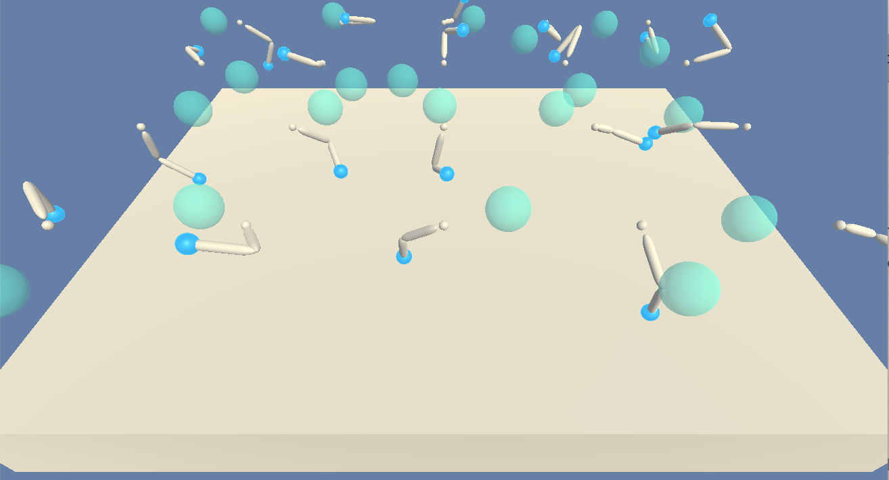

# Project 2: Continuous Control

### Introduction

This project implements the second project of the [Udacity Deep Reinforcement Learning Nanodegree](https://www.udacity.com/course/deep-reinforcement-learning-nanodegree--nd893). 

It makes use of [Unity ML Agents](https://github.com/Unity-Technologies/ml-agents) to set up, run, and learn to navigate the Reacher environment. In this environment the goal is to move a double-jointed robotic arm to follow a target which moves around the arm.

Specifically, the environment used here has 20 such robotic arms following 20 different targets. This environment proved to converge much more quickly because of the vastly greater number of trajectories generated at each timestep, all of which are fed into the shared replay buffer from which the agents learn. 

Here is a screenshot of the agents on a training run:




#### State Space

The environment state is described by a 33-dimensional numpy array for each agent.  An example starting state looks like:

```python
0.00000000e+00 -4.00000000e+00  0.00000000e+00  1.00000000e+00
 -0.00000000e+00 -0.00000000e+00 -4.37113883e-08  0.00000000e+00
  0.00000000e+00  0.00000000e+00  0.00000000e+00  0.00000000e+00
  0.00000000e+00  0.00000000e+00 -1.00000000e+01  0.00000000e+00
  1.00000000e+00 -0.00000000e+00 -0.00000000e+00 -4.37113883e-08
  0.00000000e+00  0.00000000e+00  0.00000000e+00  0.00000000e+00
  0.00000000e+00  0.00000000e+00  5.75471878e+00 -1.00000000e+00
  5.55726624e+00  0.00000000e+00  1.00000000e+00  0.00000000e+00
 -1.68164849e-01
```

#### Action Space

The action space is a 4-dimensional vector. Each element in the vector is a continuous value between -1 and +1 representing the torque applied to the joints.

#### Solving the environment

The Reacher environment is episodic. It is considered "solved" when the average score across all 20 agents over 100 episodes reaches 30.

### Getting Started

These instructions assume a recent version of macOS, and was tested on High Sierra (v10.13.2).

1. Ensure Python 3.6 is installed. This can be done by running `python --version` from the command line (or occasionally `python3 --version`). If not installed, it can be retrieved [here](https://www.python.org/downloads/mac-osx/).
2. Ensure "Reacher20.app" (included in the repo) opens correctly.  Double-clicking in "Finder" should yield the visual of a blank environment.
3. Install the python runtime dependencies listed in `requirements.txt` by running `pip install -r requirements.txt` from the top level of this repo.

### Training the Agent

For ease of navigation and visibility, all of the relevant classes and code to train the agent from scratch are implemented in the ipython notebook `Continuous_Control.ipynb`. To begin training, simply load the notebook and select "Cell -> Run All".

