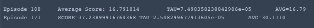
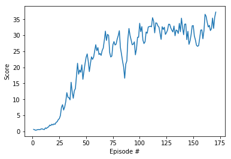

# Report

_Note:_ The code in this project is largely adapted from the implementation of the [DDPG Pendulum](https://github.com/udacity/deep-reinforcement-learning/tree/master/ddpg-pendulum) exercise from the DRLND github repo.  This is the only code that was re-used or "copied" from any other source.

### Learning Algorithm

The algorithm is a straightforward implementation of DDPG as described in the [Deep Mind ICLR conference paper](https://arxiv.org/pdf/1509.02971.pdf) which adopts the concepts of Q-Learning to a continuous domain.

DDPG is an actor-critic method. The Actor learns the policy $\pi_\theta$ and outputs the action(s) for the agent to take.  This takes the form of a Neural Network function approximator; in this case the network is a 3-layer network, with the first two layers consisting of batch normalization prior to a ReLU activation, and the third layer implementing a `tanh` activation.

The Critic network approximates the action-value function and also consists of three layers including batch-normalization and ReLU activations in the first two layers, followed by a linear output layer.

The DDPG algorithm specifies generating trajectories ($s_t, a_t, r_t,s_{t+1}$) through interacting with an environment using the target actor network to select the actions. These trajectories are stored off-policy in a replay buffer and are then used to train the local Critic action-value approximation through use of the recursive Bellman equation (having substituted the future action with the prescribed Actor's output):

$Q^\pi(s_t,a_t) = E[r(s_t,a_t)+\gamma E[Q^\pi(s_{t+1},\pi(s_{t+1})]]$

This equation gives the Critic loss function, which, when applied with the target Actor's policy, provides a suitable loss function for the Actor's policy itself. Thus it becomes a standard supervised-learning problem at each timestep and can be backpropagated with the autograd features in PyTorch.

### Tuning

To achieve the performance described below, certain hyperparameters for the algorithm had to be tuned to find a satisfactory result. The hyperparameters chosen were determined through trial-and-error, where necessary.

These hyperparameters are described as follows:

**Replay Buffer Size**

`BUFFER_SIZE = int(1e5)` 

The replay buffer size is the number of agent experiences available in the buffer for sampling during the training stage of the local Actor and Critic. Thus a larger value ensures that the network is learning from experiences outisde of its own recent history, but as this buffer is stored in memory, it is resource-constrained.  For this project, run on 2014 Macbook Pro, a buffer size of 10^5 experiences was sufficient.

**Batch Size**

`BATCH_SIZE = 1200`

This is the number of samples taken from the Replay Buffer each time the fully-connected is trained. Increasing the batch size slowed down training, but too small of a batch size led to unstable learning. 1200 struck the correct balance of stability and training duration.

**Gamma - Discount Factor**

`GAMMA = 0.99`

This is the time-discount factor, which is applied to the expected action-value of the subsequent state. A low value here optimizes for short-term rewards, while a value close to 1 discounts future rewards very little. The nature of the problem means that differentiating between short-term and long-term rewards yielded negligible changes in policy (or rather, the goals for short-term rewards are nearly identical to goals for long-term rewards), so was kept near to `1.0`.

**Tau**

`MAX_TAU = 5e-4`

`MIN_TAU = 1e-5`

This controls how much the Actor and Critic target networks are updated after each learning and optimization stage.  A value of 1 replaces the expected Q values entirely, while a value of zero equates to no update. This comes down to the "exploration vs exploitation", so the strategy here is to increase exploration when the "quality of experience"-- or successful trajectories-- is low, and decrease it as the agent gains quality experience.  Too little exploration leads to the agent converging very slowly or not at all, and too much exploration leads to a low ceiling on exploited successed.

**Learning Rate**

`LR_ACTOR = 1e-4`

`LR_CRITIC = 1e-4`

The learning rate is a parameter of the FC Actor and Critic networks' optimizers that determines how much the weights are updated on each pass through the optimizer (in this case ADAM). This is closely related to the value of TAU, in that it defines how highly to value the newly-trained experiences. In general, increasing the value of TAU provided a better speed-stability trade-off than increasing the Actor/Critic learning rates.

### Performance

This implementation "solved" the environment (gaining a score of >30 averaged over 100 consecutive episodes) after running for approximately 170 episodes. The console output and a plot of the scores are displayed below.

### Future Improvements

#### Prioritized Experience Replay

PER is exactly what it sounds like.  Instead of sampling randomly from the experience buffer, as is done in this project, PER assigns an "error" score to each experience based on the difference between the expected reward and the observed reward for that experience. This has not been implemented but could have a significant benefit in reducing the number of episodes required to solve this environment.

#### Model-based algorithms instead of DDPG

In contrast with model-free RL algorithms that attempt to predict optimal action-value functions or policy functions, model-based RL algorithms go one level deeper to attempt prediction of state transitions given a current state and taking some action. Because of the simplicity underlying the target dynamics in the Reacher environments, it would make sense to try to identify the time-dependent pattern of the target itself.

This approach would open up the realm of time-series-based supervised-learning techniques including RNNs and LSTMs and be expected to provide a much more efficient learning algorithm.